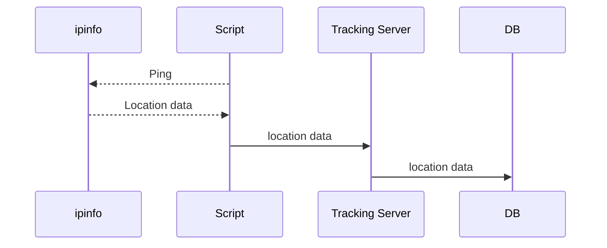

# WHERE trackee script

This script runs on a cron job to send location data, based on current IP address

- may not provide accurate location data if using VPN
- longitude/latitude is not the trackee's precise location, rather the coordinates of the city returned

## What it does

## Installing

1. run `install.sh` (copies folder to `~/.where`)

2. enter cron editor `crontab -e`

3. enter insert mode `i`, then add: `0 */2 * * * perl ~/.where/ping.pl > ~/.where/logfile.log 2>&1`

4. save and exit: `esc`, `:wq`, `enter`

This will set the script up to run every second hour on the hour
